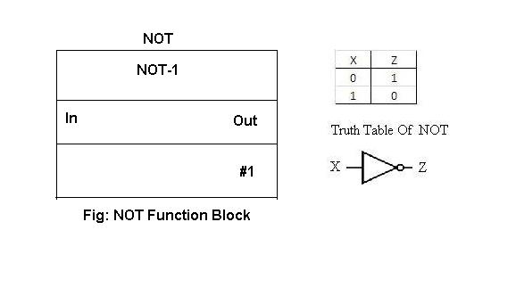

### **Theory**

In the previous experiment the hardware and software associated with Distributed Control System is discussed.
In this experiment the software and programming concept is discussed.
There are several programming languages used for logic development.
The IEC 61131 standard part3 specifies these languages as:
1. Ladder Logic (LD)
2. Structured Text (ST)
3. Instruction List (IL)
4. Sequential Flow Charts (SFC)
5. Functional Block Diagram (FBD)

Generally in DCS Functional Block Diagram (FBD) is used for programming and Sequential Flow Charts (SFC) is preferred for batch control applications.

### **Functional Block Diagram (FBD) Basics:**

This language basically is a graphical language wherein the users are allowed to program elements in the form of blocks. The blocks then can be wired together like electrical circuits. It describes a function between input and output variables.
It is a graphical method of programming DCS. Functional algorithms and control strategies for a particular plant can be implemented by FBD. The control modules are treated as unique entity in DCS system. Each function block contains specific algorithm such as AI, AO, DI, DO, PID and the parameters required for the algorithm. Function blocks ranges from simple input conversion block to a complex control strategy.

Generally available Function blocks are:
1. Input/ Output (I/O)
2. Math
3. Logical
4. Timer/ Counter
5. Analog Control
6. Advanced control

### **A Typical Function block -**

The description of the various parameters associated with this block:

* Definition name: This is the name by which the block is identified in the library.
* Usage name: This name can be user defined as per his/her convention.
* Parameters: These are part of the function block available for standard connection.
* Execution number: The number by which the function block is executed.

Following functions blocks are generally available in the libraries.
### **1.Input Output library**

* Analog Input
* Analog Output
* Discrete Input
* Discrete Output
* Pulse Input

### **2.Math Library**

* Add
* Comparator
* Divide
* Multiply
* Subtract
* Absolute value
* Integrator

### **3.Logical Library**

* And
* Or
* Condition
* Not
* Negative Edge Trigger
* Positive Edge Trigger
* Multiplexer
* De multiplexer

### **4.Timer / Counter Library**

* On Delay Timer
* Off Delay Timer
* Counter
* Retentive Timer
* Timed Pulse

### **5.Analog Control Library**

* Input Selector
* Limit
* PID
* Ratio
* Ramp
* Filter
* Scalar
* Signal Characterizer
* Signal Generator
* Signal Selector
* Splitter

Let us discuss about the commonly used Input/ Output library function blocks.
### **Analog Input function Block -**

Analog Input (AI) Function Block accesses a single Analog measurement value and its status on the AI channel. In manual mode, when AI block is configured, input has to be in engineering units as well as output is indicated in engineering units on the screen. In automatic mode, output of the block will reflect process variable value. Input to the block could be 4-20mA or digitally communicated variable from HART based transmitter.

### **Analog Output function Block -**
Analog output (AO) function block assigns any output value to a field devices like control valve through a specific AO channel. In manual mode, the output parameter value can be set manually. In automatic mode, OUT is set automatically based on set point and process variable value in engineering units. A feedback can also be set for the output parameter.

### **Discrete (digital) Input (DI) Function Block -**

The Discrete Input (DI) Function blocks accesses a single digital input value with its status between two states of the field devices. The block gives processed physical input for other function blocks. In automatic mode, Process variable is copied to output which can be either 0 or 1. In manual mode, the digital input can be toggled manually and output follows the same.

### **Discrete (digital) Output (DO) Function Block –**

Digital Output block takes value from the process and writes it to specific digital output channel. One can confirm physical output operation by configuring a hardware discrete input to it. In automatic mode, when the signal from process changes the output of the block which will be connected to AO channel which in turn connects to field outputs e.g a solenoid valve, changes.

### **Logical Library:**

Commonly used logical blocks under logical library are described here

### **AND Function Block:**

AND function block is used as an AND operator. For 2 input AND gate if both the inputs are high the output of the function block is high.

The function block and the truth table is as given below:

### **OR Function Block:**

OR function block is used as an OR operator. For 2 input OR gate if any one inputs is high, the output of the functions block is high. The function block and the truth table is as given below:

### **NOT Function Block:**

NOT function block is used as NOT operator, wherein if the input to the block is high or active the output is opposite i.e. low and vice versa. The function block and the truth table are as given below:

Let us look at how programming is done using these blocks. The details are given in under procedure tab.